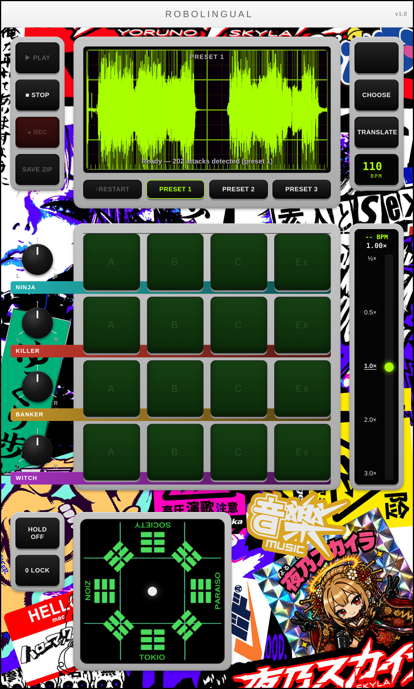
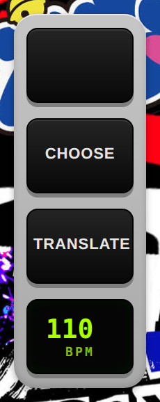
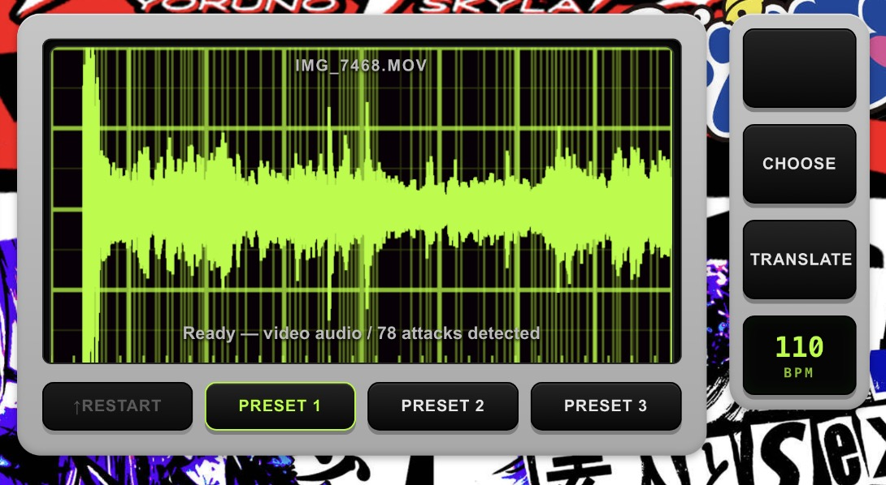
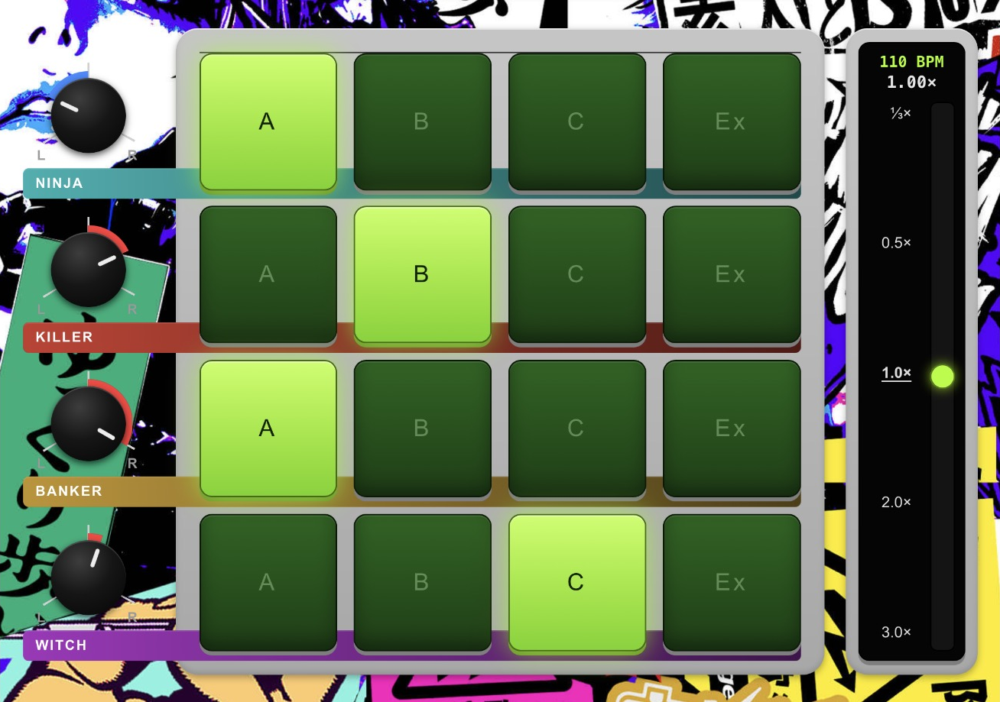
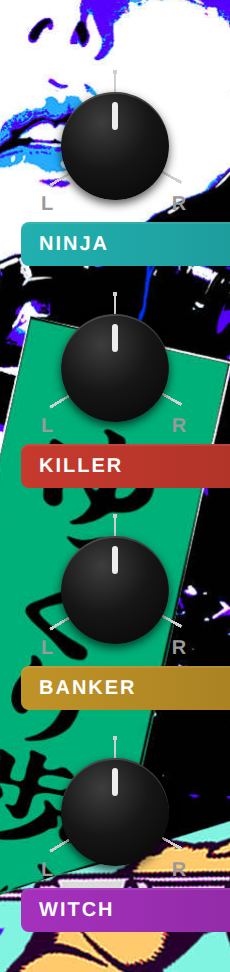
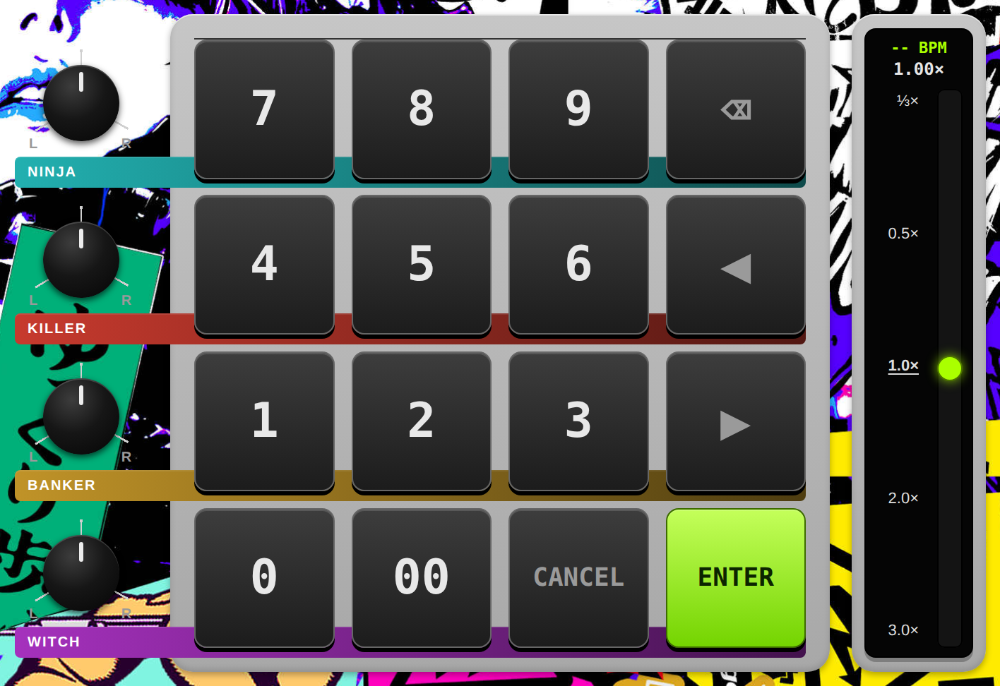
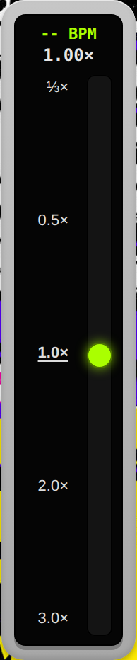
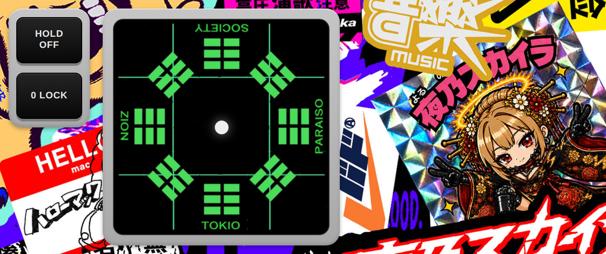
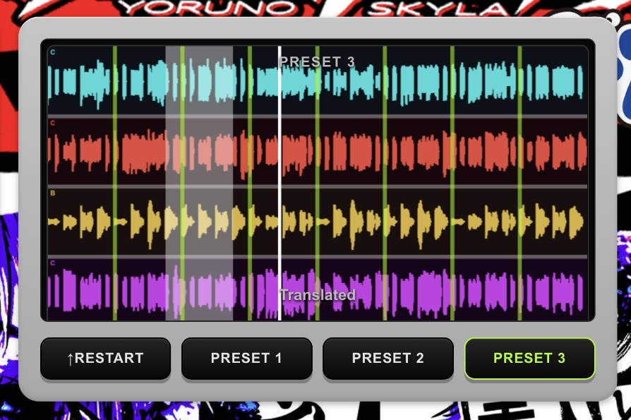
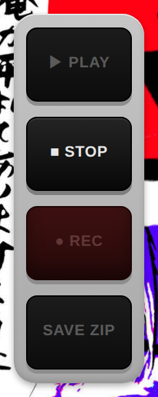

ROBOLINGUAL v1.0 マニュアル

<!-- 画像スロット: アプリ全体のスクリーンショット
     使うときは次の行のコメントを外す

-->

1. 音声を読み込む

<!-- 画像スロット: CHOOSE / PRESET / TRANSLATE まわり(画面右上)
     使うときは次の行のコメントを外す

-->
* CHOOSE を押して、音声または動画ファイルを選択します。
* 対応形式：WAV、MP3、M4A、AAC、MP4、M4V、MOV
* 動画を選んだ場合は、波形の中のボタンが READ VIDEO に変わります。押すと音声の取り出しが始まります。

    * 取り出しは動画を最後まで再生しながら行うため、動画の長さぶん時間がかかります
    * 進み具合は画面の中央に％で出ます。終わるまで画面を開いたままにしてください
    * iPhoneの写真アプリから選んだ場合、ファイルが渡されるまで少し待つことがあります

* PRESET 1 / PRESET 2 / PRESET 3 を押すと、用意された音源をそのまま読み込めます。

2. ロボ語を生成

<!-- 画像スロット: TRANSLATE後の波形ディスプレイ(Ready表示)
     使うときは次の行のコメントを外す

-->
* TRANSLATE を押すと、現在読み込まれている音声からロボ語を生成します。
* 同じ素材でも何度でも再生成できます。
* BPMを変更すると、生成されるロボ語のテンポを変更できます。
* 生成されるのは16パターン（4キャラクター × 4バリエーション）です。
* ループの長さは8小節です。

3. パターンを選ぶ

<!-- 画像スロット: 16パッド全体。1つ点灯した状態
     使うときは次の行のコメントを外す

-->
* 縦4段がキャラクター、横4列がバリエーションです。
* ロボ語には4つのキャラクターがあります。

    * NINJA：しなやかなロボ語。伸ばしとピッチベンドが主役
    * KILLER：硬く攻撃的なロボ語。短く密な連打
    * BANKER：生真面目なロボ語。拍ごとに確実にキックを打つ
    * WITCH：気まぐれなロボ語。不規則に間引いて飛ばす

* 各キャラクターに4つのバリエーションがあります。

    * A：短く、密で、乾いた発音
    * B：長く、丸く、アタック少なめ
    * C：4スライスの固定パターン
    * Ex：ワンショットの必殺技

* パッドを押すと、そのバリエーションに切り替わります。
* 点灯中のパッドをもう一度押すと、消灯してその段が止まります。
* Ex は押した瞬間に一発だけ鳴ります。点灯したままにはなりません。
* Ex は連打できます。連打すると頭の一撃が繰り返され、フィルインになります。
* ↑RESTART を押すと、生成したパターンはそのままで、ループを頭から鳴らし直します。

4. PAN

<!-- 画像スロット: 左側のPANノブ4つ
     使うときは次の行のコメントを外す

-->
* 左側の4つのノブで、キャラクターごとの左右の位置を決めます。
* 上から NINJA / KILLER / BANKER / WITCH です。
* ノブはドラッグして回します。
* ループ（A/B/C）もワンショット（Ex）も、同じキャラクターなら同じ位置から鳴ります。

5. BPM

<!-- 画像スロット: 16パッドがテンキーに変わった状態
     使うときは次の行のコメントを外す

-->
* 設定できる範囲は 60〜260 です。
* スマホ・タブレットでは、BPM を押すと16パッドがテンキーに変わります。

    * 開いた直後に数字を押すと、今の値を消して打ち直しになります
    * 今の値を直すときは、先に ⌫ か ◀ を押します
    * ◀ ▶ でカーソルを動かし、途中に数字を挿し込めます
    * ENTER で確定、CANCEL で取り消し

* PC では BPM の欄をクリックして直接入力できます。テンキーは出ません。

6. MASTER SPEED

<!-- 画像スロット: 右側の速度スライダー
     使うときは次の行のコメントを外す

-->
* TRANSLATE時に設定したBPMを元に、全体の再生速度を変更します。
* 範囲は ⅓×〜3.0× です。
* 目盛りをタップすると、その速度へ一発で移動します。
* ダブルクリックで 1.0× に戻ります。

7. 八卦盤

<!-- 画像スロット: 八卦盤。HOLD / 0 LOCK も入るように
     使うときは次の行のコメントを外す

-->
* 後天八卦をかたどった盤です。ロボ会話の方向性を決めます。
* 中心がドライ（原音）で、外周へ行くほど深くかかります。
* HOLD：OFFのときは指を離すとゼロ地点に戻ります。ONのときは離した場所に張り付きます。
* 0 LOCK：戻る先であるゼロ地点を、今いる場所に設定します。初期値は中央（ドライ）です。

8. スリップループ

<!-- 画像スロット: 波形を押さえて白い帯が出ている状態
     使うときは次の行のコメントを外す

-->
* 演奏中に波形を指で押さえると、直前に鳴っていた音がその場でループします。
* 押した瞬間から遡って4拍ぶんを切り取ります。押している間は同じ素材を使い続けます。
* 波形は2段×3列の6区画に分かれています。押さえたまま指をずらすと刻みが変わります。

    * 上段：左=1、中=1/32、右=1/16
    * 下段：左=1/2、中=1/4、右=1/8

* 刻みを変えても音の出頭は動きません。ループの終わりだけが伸び縮みします。
* サンプリングしている範囲は、波形の上に白く光る帯で表示されます。刻みが細かいほど点滅が速くなります。
* 1/32 だけは帯が細くて見えにくいため、白い芯のまわりが発光して見える表示になります。発光の色は折り返しごとに赤と黄で入れ替わります。
* 指を離すと元の演奏に戻ります。

9. プレイヤー

<!-- 画像スロット: PLAY / STOP / REC / SAVE
     使うときは次の行のコメントを外す

-->
* PLAY：再生
* STOP：停止
* REC：再生中のロボ語を録音します。八卦盤やスリップループも、聴こえているまま録れます。
* SAVE：直前に触っていたものに応じて保存先が変わります。

    * SAVE ZIP：生成した16パターンのWAVをZIPでまとめて保存します（16パッドを最後に触った場合）
    * SAVE WAV：録音した演奏を保存します（PLAY / STOP / REC を最後に触った場合）

10. キーボードショートカット
* Z：HOLD の切り替え
* X：0 LOCK
* 文字入力中は無効になります。

【使い方の例】
1. CHOOSE または PRESET で音源を読み込む
2. BPM を決める
3. TRANSLATE
4. キャラクターとバリエーションを選ぶ
5. 必要に応じて SAVE ZIP
6. PAN・MASTER SPEED を調整
7. PLAY で確認
8. 八卦盤とスリップループで組み替える
9. REC → SAVE

【ヒント】
* 同じ素材でも、TRANSLATE を押すたびに異なるロボ語が生成されます。気に入ったものができるまで、何度でも試してみてください。
* 4段は同じタイムラインの上を走ります。どう組み替えても頭がずれません。
* PAN で4人を左右に散らすと、それぞれの動きが聴き分けやすくなります。
* 0 LOCK で軽く歪ませた場所をゼロ地点にしておくと、そこを基準に出たり戻ったりできます。
* スリップループは指を離しても時間が止まりません。離した時点の現在地からそのまま続きます。
* 音が出ないときは、画面をどこか一度タップしてから PLAY を押してください。ブラウザは一度触るまで音を出せない決まりになっています。
