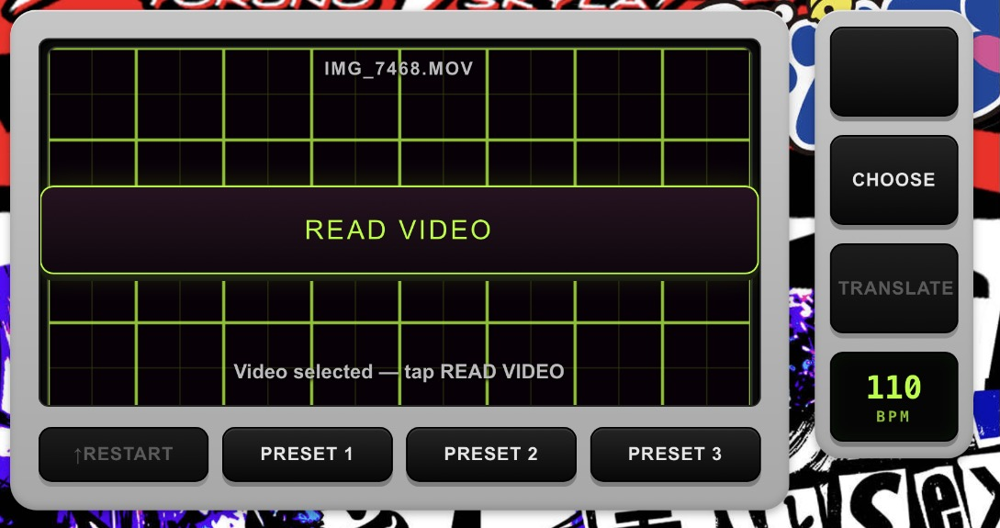

ROBOLINGUAL v1.0 マニュアル

▶ アプリを開く： https://robolingual.github.io/

<!-- 画像スロット: アプリ全体のスクリーンショット
     使うときは次の行のコメントを外す

-->

1. はじめる

<!-- 画像スロット: CHOOSE / PRESET / TRANSLATE まわり(画面右上)
     使うときは次の行のコメントを外す

-->
* PRESET 1 / PRESET 2 / PRESET 3 を押すと、読み込みから生成まで自動で進みます。まずはこれで。
* 自分の音源を使うときは CHOOSE でファイルを選び、TRANSLATE を押します。
* 対応形式：WAV、MP3、M4A、AAC、MP4、M4V、MOV
* BPM は TRANSLATE の前に決めてください。あとから変えても、生成済みのテンポは変わりません。

動画を使うとき

<!-- 画像スロット: READ VIDEO に変わったボタン
     使うときは次の行のコメントを外す

-->
* ボタンが READ VIDEO に変わります。押すと取り出しが始まります。
* 動画の長さぶん時間がかかります。終わるまで画面を開いたままにしてください。

2. 16パッド

<!-- 画像スロット: 16パッド全体。1つ点灯した状態
     使うときは次の行のコメントを外す

-->
* 縦4段がキャラクター（NINJA / KILLER / BANKER / WITCH）、横4列がバリエーション（A・B・C・Ex）です。
* 押して切り替え、点灯中をもう一度押すと消灯します。
* Ex だけはワンショットで、押した瞬間に一発鳴ります。連打するとフィルインになります。
* 4段は同じタイムラインの上を走ります。どう組み替えても頭がずれません。

3. スリップループ

<!-- 画像スロット: 波形を押さえて白い帯が出ている状態
     使うときは次の行のコメントを外す

-->
* 演奏中に波形を指で押さえると、今さっき鳴っていた1拍がその場で繰り返されます。
* 押さえたまま指をずらすと刻みが変わります。

    * 上段：左=1、中=1/32、右=1/16
    * 下段：左=1/2、中=1/4、右=1/8

* 数字は1拍を何分割するかです。
* 指を離すと元の演奏に戻ります。時間は止まっていないので、離した時点から続きます。

4. 八卦盤

<!-- 画像スロット: 八卦盤。HOLD / 0 LOCK も入るように
     使うときは次の行のコメントを外す

-->
* ロボ会話の方向性を決めます。中心がドライ（原音）で、外周へ行くほど深くかかります。
* HOLD：ONにすると、指を離した場所に張り付いたままになります。
* 0 LOCK：指を離したときに戻る場所を、現在地に設定します。初期値は中央（ドライ）。
* 0 LOCK で軽く歪ませた場所を戻り先にしておくと、その状態を基準に出たり戻ったりできます。

5. 保存する

<!-- 画像スロット: PLAY / STOP / REC / SAVE
     使うときは次の行のコメントを外す

-->
* SAVE は直前に触っていたものによって中身が変わります。

    * SAVE ZIP：16パターンのWAVをまとめたZIP（16パッドを最後に操作した場合）
    * SAVE WAV：録音した演奏1本のWAV（PLAY / STOP / REC を最後に操作した場合）

* 狙った方を保存したいときは、先にその側を一度操作してから押してください。
* REC は八卦盤もスリップループも、聴こえているまま録れます。

6. その他
* MIDI：画面右上に MIDI が出ていれば、市販のMIDIパッドで16パッドとPANを操作できます。押すと画面の指示どおりに叩いて覚えさせる流れになります。
* SKIN：画面右上の SKIN から、背景の板を好きな画像に差し替えられます。
* ショートカット：PCのみ。Z で HOLD の切り替え、X で 0 LOCK。

【仕様】
* ループ長：8小節 固定
* BPM：60〜260
* 再生速度：⅓×〜3.0×
* パッド：16（4キャラクター × A・B・C・Ex）
* スリップ刻み：1 / 1/2 / 1/4 / 1/8 / 1/16 / 1/32（1拍を分割）
* 八卦盤：4方向 ＋ 斜め4地獄ゾーン
* 入力形式：WAV / MP3 / M4A / AAC / MP4 / M4V / MOV
* 書き出し：16パターン ZIP ／ 演奏 WAV

【困ったときは】
* 音が出ない：画面をどこか一度タップしてから PLAY を押してください。ダメならリロード。
* パッドが押せない：「Ready」と表示されるまでお待ちください。
* 生成結果が気に入らない：もう一度 TRANSLATE を押すと、別の16パターンになります。
